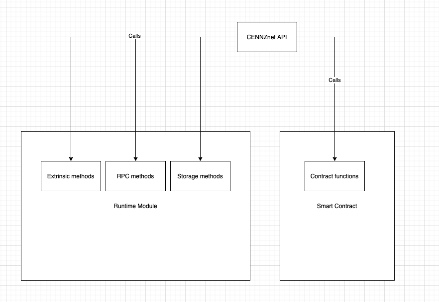

# CENNZnet technical overview

There are many pieces of technology and tools that contribute to CENNZnet. This article will describe their purposes and how they fit together.

## Interacting with CENNZnet

You can either interact with CENNZnet programmatically  through the JavaScript API, or through visual interfaces.

### CENNZnet API

A JS API that lets you subscribe to events on CENNZnet, submit transactions, and interact with the nodes. The API lets you call extrinsic methods that are exposed by the runtime modules

### Visual interfaces

There are a couple tools that let you interact with CENNZnet visually. These tools are open-source and hosted by the CENNZnet team. You are invited to contribute to improving these tools!

#### CENNZnet.io

[CENNZnet.io](https://cennznet.io/#/) provides a wallet and a GUI to the CENNZnet API and communicates with a node.

It also serves as a very helpful development tool. If you a new to CENNZnet DApp development, be sure to read the following user guides to CENNZnet.io:
* [Intro Guide to CENNZnet.io](https://medium.com/centrality/using-cennznet-io-ac5a90f9a2cb)
* [Advanced Guide to CENNZnet.io](https://medium.com/centrality/advanced-guide-to-cennznet-io-33be90f26ff3)

#### UNcover 

[UNcover](https://uncoverexplorer.com/) allows you to explore and search for transactions, addresses, prices and other activities on CENNZnet MainNet. This information may not be stored on a single node.

## How CENNZnet works

CENNZnet is a public blockchain network, which means anyone can join the network by setting up a CENNZnet node that connects to the CENNZnet MainNet. 

By joining the network, you participate in block production, which keeps the network running, and governance, which determines the rules and logic of CENNZnet. This means CENNZnet is a decentralised system owned by the participants of the network. 

The CENNZnet team from Centrality is the founding members of CENNZnet. We currently perform most of the tasks to maintain and develop the network. As time goes on, CENNZnet will become more decentralised and eventually run by the community of developers and investors.

### CENNZnet networks and genesis files

Anyone can start a new CENNZnet network by starting a CENNZnet node. When you run a CENNZnet node, you can connect to an existing chain using a genesis file. The genesis file provides the initial state and configurations of the blockchain.

In the CENNZnet repository, you can find 3 genesis configurations. 
* **Azalea (the MainNet)**: is the production environment, where transactions and exchanges happen. The MainNet is used by all CENNZnet DApps. 

* **Nikau (the TestNet)**: is an environment for testing bleeding edge features before they are deployed to Azalea. Nikau runs on nodes hosted on AWS. The CENNZnet team maintains Nikau and keeps it close to the MainNet.

* **Rata (the local TestNet)**: is a sandbox chain for testing locally. It starts a chain of nodes that runs in docker containers, all on your local machine. This allows you to test complex scenarios that aren't possible to test with a development chain, which consists of 1 node only.

### The internals of CENNZNet

#### Runtime Modules

Runtime modules are building blocks of CENNZnet that provide bundles of functionalities. The runtime modules expose methods that allow you to interact with the chain. Modifications to runtime modules require a runtime upgrade transaction on CENNZnet. Changes to runtime modules need to be approved by governance.

#### Smart Contracts

Smart contracts are small pieces of code that allows developers to add custom functionalities on top of the core functions provided by the runtime modules.
Smart contracts can be created, deployed, and called by anyone on the network.
Our article [What are smart contracts](https://cennz.net/publications/what-are-smart-contracts/) explains smart contracts in more detail.

### The public interface of CENNZnet

When developing a DApp, you will be interacting with the top layer of CENNZnet through the API.
The top layer interface of CENNZnet exposes callables that belong to the following categories:
* Runtime module methods: each runtime module exposes a set of methods to interact with them.
    - Storage methods: read data from the chain
    - Const methods: read const data from the chain
    - Extrinsics methods: submit transactions that modify data on the chain
    - RPC methods: interact with the node for administrative tasks

* Smart contract functions: public functions that can be deployed and called by anyone.

## Joining the network

As a DApp developer, it is beneficial to join the network. Having nodes of your own allows your DApp to have better and faster access to the network. You can also monitise from the nodes by participating in staking as a validator.

To learn about how to set up a validator node, read our guides in the Guides -> Node operators section.